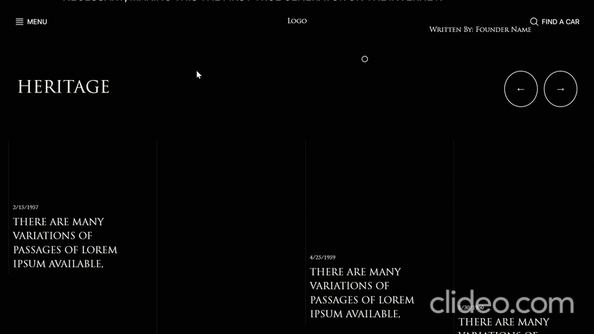

# Automotive Marketplace & Storefront

Full-stack dealership storefront for browsing inventory and submitting leads, with motion-focused UI and smooth page transitions.

## Tech Stack
- **Framework:** Next.js 14 (App Router)
- **Styling:** Styled Components, Tailwind CSS, CSS Modules
- **Animation:** GSAP (GreenSock) & Framer Motion
- **Smooth Scroll:** Lenis (react-lenis)
- **Transitions:** View Transitions API
- **Database:** MongoDB + Mongoose (inventory & leads)

## Implemented Features
- Inventory browsing backed by MongoDB/Mongoose, including filtering (model, year, price)
- Vehicle detail pages with motion/transition layer
- Lead capture (inquiries / test-drive requests) stored in MongoDB
- Cursor heatmap tracking for engagement analytics (stored in MongoDB and visualized in the admin dashboard)

## Notable Engineering Decisions
- **URL-driven filtering:** filter state is encoded in query params (e.g. `/stock?...`) so results are linkable/shareable and persist across navigation.
- **Data-driven filter options:** filter menus are generated from MongoDB using `Car.distinct(...)` via a dedicated API route (`/api/filters`), keeping the UI in sync with available inventory values.
- **Batched interaction analytics:** heatmap data is stored as batches of `{ x, y, type, timestamp }` per page to reduce write pressure compared to per-event logging.
- **SSR vs motion isolation:** Server Components handle SEO/data fetching while Client Components are reserved for GSAP/Lenis interaction layers.

## Architecture (High-level)
- Server Components for SEO and data fetching
- Client Components for GSAP/interaction-heavy UI
- Shared MongoDB schemas used across storefront + admin dashboard

## Data Model (Mongoose)
- Car, CarMake, FeaturedCar
- Enquiry, Client, Review
- HeatMap (batched cursor interactions per page)

## Privacy
- Heatmap tracking stores cursor coordinates, interaction type, and timestamps. No keystrokes or form inputs are captured.

## Roadmap
- Navigation redesign (GSAP stagger effects)
- Vehicle gallery overhaul (CSS Grid + Splide)
- SEO: dynamic metadata for vehicle pages
- Communication suite: Resend emails + WhatsApp inquiry links
